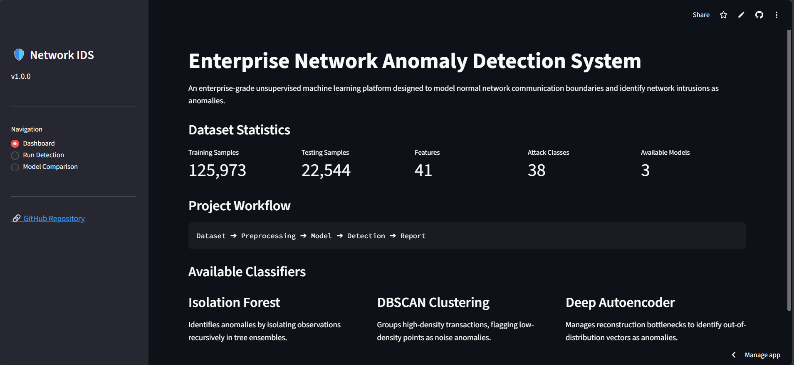
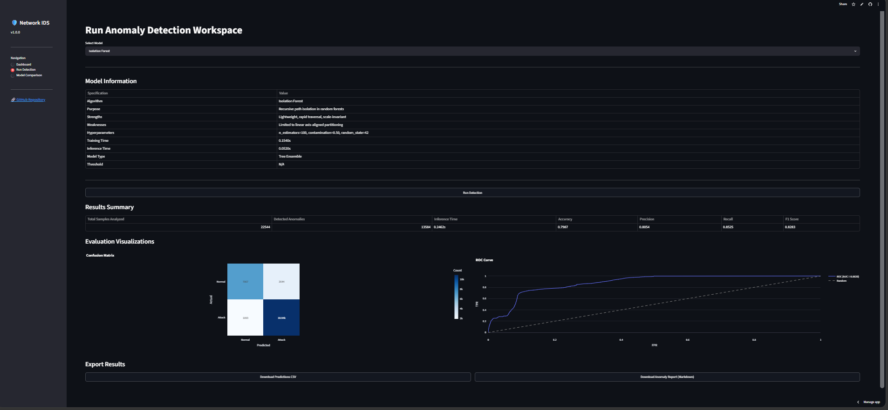
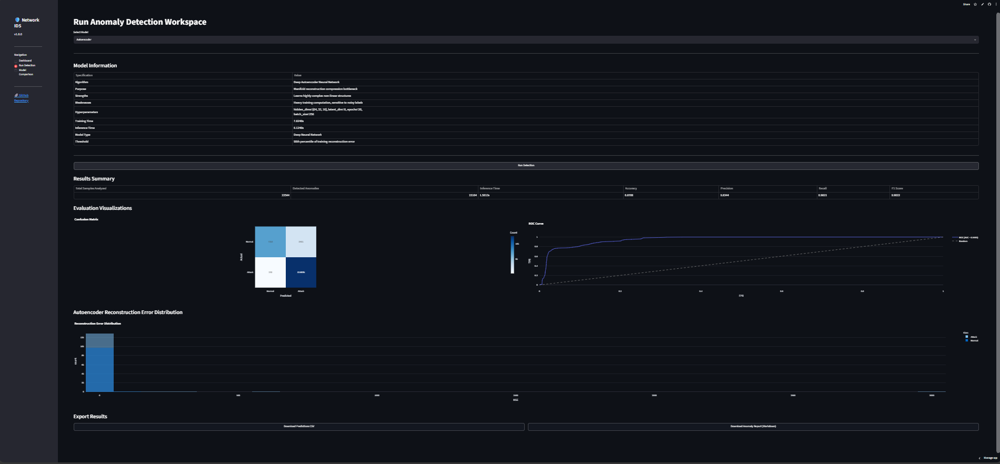
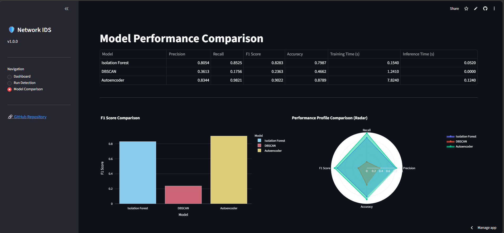

# Enterprise Network Anomaly Detection System

An enterprise-grade, unsupervised machine learning platform designed to model normal network transaction boundaries and identify malicious packets as anomalies without relying on signature databases.



---

## Project Overview

Traditional Network Intrusion Detection Systems (NIDS) rely on pre-configured signature databases, rendering them ineffective against zero-day exploits and novel cyber attacks. 

This project establishes a robust baseline of normal network transactions by training unsupervised machine learning models strictly on normal connection packets. During inference, intrusions are flagged as anomalies that deviate from this normal baseline. In real-world enterprise environments, real-time intrusion labels are rarely available, making unsupervised models essential for out-of-distribution generalization.

---

## Features

- **Three Complementary Detectors**: Implements Isolation Forest, DBSCAN, and a Deep Autoencoder to provide diverse security boundary coverages.
- **Modular Architecture**: Decoupled preprocessing (`src/data/`), model wrappers (`src/models/`), metrics engine (`src/evaluation/`), and visualization layers (`src/visualization/`).
- **Interactive Visualizations**: High-contrast, responsive Plotly confusion matrices, ROC curves, and reconstruction error histograms.
- **Static Spec Grid**: Exposes detailed algorithm parameters, latent dimensions, and training times in the UI without model deserialization overhead.
- **Cached Predictions Export**: Exports labeled prediction CSV logs and Markdown security reports instantly from session state without re-running models.

---

## System Architecture

The NIDS platform processes network traffic through a sequential five-stage pipeline:

```text
[Raw Network Packets] ➔ [Scaling & Categorical Encoding] ➔ [Unsupervised Machine Learning Models] ➔ [Anomalous Packet Labeling] ➔ [Metric Evaluation & Export]
```

### Pipeline Overview
1. **Data Ingestion**: Standardized loading of standard raw text formats from the NSL-KDD dataset.
2. **Preprocessing**: Fits encoders and standardizers strictly on normal training data splits, serializing parameters to prevent data leakage during inference.
3. **Inference Engine**: Executes anomaly detection using tree ensembles, density clustering, or deep bottleneck reconstruction.
4. **Metric Evaluation**: Compiles accuracy, precision, recall, F1 scores, and processing latencies.
5. **Interactive Interface**: Presents metrics, distribution curves, and interactive CSV download channels.

---

## Repository Structure

```text
network-anomaly-detection/
│
├── assets/
│   ├── dashboard.png               # Dashboard landing screenshot
│   ├── model_comparision.png       # Model comparison screen screenshot
│   ├── run_detection_ae.png        # Autoencoder detection screenshot
│   └── run_detection_if.png        # Isolation Forest detection screenshot
│
├── configs/
│   └── config.py                   # Centralized paths, seeds, and hyperparameters
│
├── data/
│   ├── raw/
│   │   ├── KDDTest+.txt            # NSL-KDD testing split
│   │   └── KDDTrain+.txt           # NSL-KDD training split
│   └── processed/
│       ├── label_encoders.joblib   # Categorical encoders
│       ├── scaler.joblib           # Fitted StandardScaler offsets
│       └── x_scaled.npy            # Pre-scaled training vectors cache
│
├── models/
│   ├── metrics/
│   │   ├── autoencoder_metrics.json
│   │   ├── dbscan_metrics.json
│   │   └── isolation_forest_metrics.json
│   └── trained/
│       ├── autoencoder.keras       # Trained Autoencoder neural net weights
│       └── isolation_forest.joblib # Serialized Isolation Forest model
│
├── notebooks/
│   ├── 01_dataset_loading.ipynb
│   ├── 02_exploratory_data_analysis.ipynb
│   ├── 03_data_preprocessing.ipynb
│   ├── 04_isolation_forest.ipynb
│   ├── 05_dbscan.ipynb
│   ├── 06_autoencoder.ipynb
│   └── 07_model_comparison.ipynb
│
├── src/
│   ├── data/
│   │   ├── dataset.py              # Ingestion utilities
│   │   └── preprocessing.py        # Scalers and encoders loaders
│   ├── evaluation/
│   │   ├── comparison.py           # Ranking utilities
│   │   └── metrics.py              # Precision, Recall, F1 calculations
│   ├── models/
│   │   ├── autoencoder.py          # Autoencoder training and error scoring
│   │   ├── dbscan.py               # DBSCAN clustering wrapper
│   │   └── isolation_forest.py     # IF train/predict wrappers
│   └── visualization/
│       ├── pca.py                  # 2D PCA projection coordinates compiler
│       └── plotly_plots.py         # Standardized interactive figures layer
│
├── app.py                          # Streamlit application main entry point
├── LICENSE
├── requirements.txt
└── README.md
```

---

## Installation

Ensure Python 3.10+ is installed. Clone the repository and install the dependencies from requirements.txt:

```bash
pip install -r requirements.txt
```

---

## Usage

### Streamlit Application
Launch the interactive security dashboard locally using:

```bash
streamlit run app.py
```

### Jupyter Notebooks
To inspect or retrain the models step-by-step, run the notebooks in order:
1. `01_dataset_loading.ipynb`: Raw text log validation.
2. `02_exploratory_data_analysis.ipynb`: Class distributions.
3. `03_data_preprocessing.ipynb`: StandardScaler fitting.
4. `04_isolation_forest.ipynb`: Path traversal anomaly isolation.
5. `05_dbscan.ipynb`: Density-based outlier noise clustering.
6. `06_autoencoder.ipynb`: Bottleneck reconstruction training.
7. `07_model_comparison.ipynb`: Combined performance matrix.

---

## Models Implemented

### 1. Isolation Forest
Isolates anomalies recursively using tree structures. Outlier profiles are easily partitioned near tree roots, translating to shorter path lengths. This model is extremely lightweight and achieves very low latencies.



- **Hyperparameters**: `n_estimators=100`, `contamination=0.50`
- **Use Case**: Edge nodes and firewalls requiring real-time logging speed.

### 2. DBSCAN
Groups high-density transactions based on spatial neighborhoods. Outliers that fail to fit dense core clusters are marked as noise (`-1`) and flagged as anomalies.
- **Hyperparameters**: `eps=3.0`, `min_samples=10`
- **Use Case**: Offline forensic investigations and cluster labeling.

### 3. Deep Autoencoder
An unsupervised neural network trained exclusively on normal transactions. The network compresses vectors through a low-dimensional latent bottleneck and reconstructs them at the output. Out-of-distribution attacks fail to reconstruct well, generating high Mean Squared Error (MSE) scores.



- **Architecture**: `Input(41) -> Dense(64) -> Dense(32) -> Dense(16) -> Latent(8) -> Dense(16) -> Dense(32) -> Dense(64) -> Output(41)`
- **Use Case**: Critical core network nodes requiring high anomaly recall.

---

## Performance Metrics

All models were evaluated on the unseen `KDDTest+` test set containing 17 novel attack categories absent from training:

| Model | Accuracy | Precision | Recall | F1 Score | Training Time | Inference Time |
| :--- | :---: | :---: | :---: | :---: | :---: | :---: |
| **Isolation Forest** | 0.7987 | 0.8054 | 0.8525 | 0.8283 | **0.1540s** | **0.0520s** |
| **DBSCAN** | 0.4662 | 0.3613 | 0.1756 | 0.2363 | 1.2410s | N/A |
| **Autoencoder** | **0.8789** | **0.8344** | **0.9821** | **0.9022** | 7.8240s | 0.1240s |



- **Optimal Autoencoder Threshold**: `0.022829` (MSE)
- **DBSCAN Noise Rate**: `57.80%` (indicating severe Euclidean distance convergence in 41-dimensional space)

---

## Deployment

The application is fully deployment-ready for **Streamlit Community Cloud**:
- **Python Version**: `3.10` or higher.
- **Dependencies**: Outlined completely in `requirements.txt`.
- **Serialization Compatibility**: Weights are stored in Keras native format (`.keras`) to support seamless loading across Linux/Mac/Windows hosting environments without deserialization warnings.

---

## Future Improvements

- **SHAP Integration**: Expose explainable AI (XAI) feature attributions to provide clarity on flagged anomalies.
- **Recurrent Autoencoders**: Integrate LSTM layers to capture temporal sequences and sliding-window network actions.
- **Adaptive Thresholding**: Dynamically adjust reconstruction bounds based on time-series traffic patterns.

---

## License

This project is licensed under the MIT License. See the [LICENSE](LICENSE) file for details.

---

## Author

Developed by **Jenish Upadhyay** — [GitHub Profile](https://github.com/Jenish045).